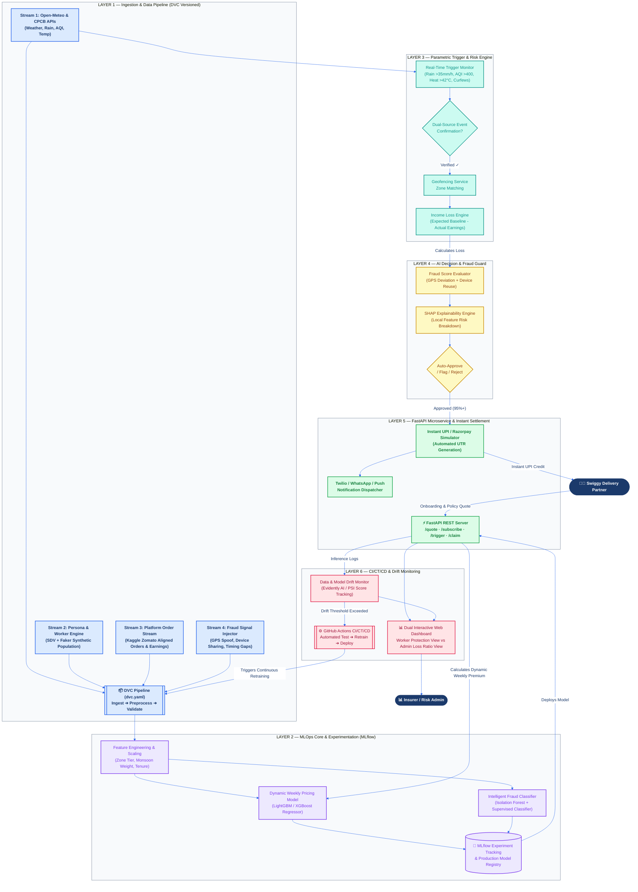

# GigEase — Comprehensive High-Level Architecture (HLD) & MLOps Blueprint

> **Project**: GigEase — AI-Powered Parametric Income Protection Platform for Swiggy Delivery Partners  
> **Hackathon Track**: Guidewire DEVTrails 2026 University Hackathon  
> **Academic Standard**: MLOps PBL Course Specification (AD4V71 / R25 Regulation)

---

## 1. Problem Statement Analysis & SDE Mindset

### Core Challenge Synthesis
Platform-based delivery partners in India (specifically **Swiggy food delivery partners**) face a 20–30% loss of monthly earnings due to uncontrollable external disruptions. Standard insurance products fail gig workers because they carry long settlement cycles, rigid monthly/annual premiums, and cover irrelevant risks (health/vehicle repairs).

**GigEase** solves this by delivering an **AI-Enabled Parametric Income Protection Platform** operating strictly on a **Weekly Pricing Model** with **Zero-Touch Automated Payouts** for **Loss of Income ONLY**.

---

## 2. Problem-by-Problem Breakdown, SDE Solutions & Tech Choices

| # | Problem to Solve | SDE Mindset & Architectural Approach | Chosen Tech, Tools & Methods | Technical Rationale |
|---|---|---|---|---|
| **P1** | **Gig Worker Income Volatility & Weekly Financial Cadence** | Build a dynamic weekly micro-premium engine ($W_{avg}$ baseline + zone risk factor) that recalculates coverage & premiums every 7 days matching the worker's payout cycle. | **Python 3.10+, Scikit-Learn, LightGBM/XGBoost, Pandas** | LightGBM provides ultra-fast tabular regression to compute dynamic weekly premiums based on historical 12-week income and zone risk. |
| **P2** | **Real-Time Disruption Verification (Parametric Triggers)** | Implement an automated dual-source trigger engine evaluating STFI (weather/pollution) and RSMD (curfew/strikes) with geofence matching to confirm income drop before initiating claims. | **Open-Meteo REST API, CPCB / OpenAQ API, `geopy`, `holidays.India`** | Open-Meteo offers keyless historical reanalysis back to 1940 for backtesting monsoon risk; `geopy` classifies metro vs tier-2 zones without commercial API costs. |
| **P3** | **Delivery Fraud & Syndicate Exploitation** | Construct a multi-layered anomaly & fraud detection pipeline checking GPS deviation, device fingerprint reuse, timing gaps, and SHAP explainability. | **Isolation Forest + Supervised Classifier, SDV (Synthetic Data Vault), Faker, SHAP** | SDV generates statistically correlated synthetic fraud signals; SHAP provides local feature attributions for auditability. |
| **P4** | **Zero-Touch Instant Claim & Payout Settlement** | Eliminate manual claim forms. When a disruption is confirmed, open a claim shell automatically and dispatch instant UPI transfers via payment simulator. | **FastAPI, Async Pydantic, Razorpay Test Mode / UPI Simulator, SQLite / PostgreSQL** | Asynchronous REST endpoints handle high-concurrency event webhooks with sub-second automated claim generation. |
| **P5** | **Data Versioning & Reproducibility (MLOps Unit I & II)** | Enforce strict dataset versioning across all 4 raw data streams (Environmental, Worker Persona, Platform Orders, Claims/Fraud) ensuring 100% reproducible model runs. | **DVC (Data Version Control), Git** | DVC tracks large datasets and pipeline steps (`dvc.yaml`) without cluttering Git repositories, guaranteeing reproducible experiments. |
| **P6** | **Experiment Tracking & Model Governance (MLOps Unit II & III)** | Track hyperparameter tuning, model metrics (MAE, RMSE, F1-Score, ROC-AUC), and register production candidate models in a central registry. | **MLflow (Tracking & Model Registry)** | MLflow provides experiment comparison, metric tracking, and a production model stage registry for smooth deployment transitions. |
| **P7** | **Production Serving & CI/CT/CD Automation (MLOps Unit III & V)** | Containerize the inference service and establish automated CI/CD pipelines that run tests and trigger continuous retraining when new data arrives or drift occurs. | **Docker, Docker Compose, PyTest, GitHub Actions** | Docker ensures environmental parity; GitHub Actions automates linting, testing, image building, and automated retraining pipelines. |
| **P8** | **Model Drift & Operational Analytics (MLOps Unit III & IV)** | Monitor prediction latency, data drift, loss ratios, and display real-time metrics on dual dashboards (Worker Coverage vs Insurer Loss Ratios). | **Evidently AI / Custom Drift Scorer, Chart.js, HTML5/CSS3 Dashboard** | Monitors feature distribution shifts (e.g. unexpected weather anomalies) and gives executive visibility into underwriting profitability. |

---

## 3. Reconstructed High-Level Architecture (HLD)

The diagram below integrates the **Parametric Income Protection Business Flow** with the **End-to-End MLOps Lifecycle Pipeline**:

---

## 4. Summary of MLOps Lifecycle Compliance

1. **Unit I — Foundation & Problem Formulation**: Structured around Swiggy delivery worker income loss, defining MLOps actors (Data Engineer, ML Engineer, Risk Admin) and baseline SLAs.
2. **Unit II — Data Versioning & Experimentation**: Implements DVC versioning on raw data streams and MLflow tracking for dynamic pricing & fraud models.
3. **Unit III — Production Serving & Explainability**: REST inference APIs powered by FastAPI, with SHAP feature explainability for every processed claim.
4. **Unit IV — Architecture & Maturity Model**: Advanced Level 1/Level 2 MLOps architecture featuring automated feature engineering and model serving.
5. **Unit V — CI/CT/CD & Retraining Automation**: Docker containerized deployment orchestrated by GitHub Actions with drift-triggered retraining loops.
